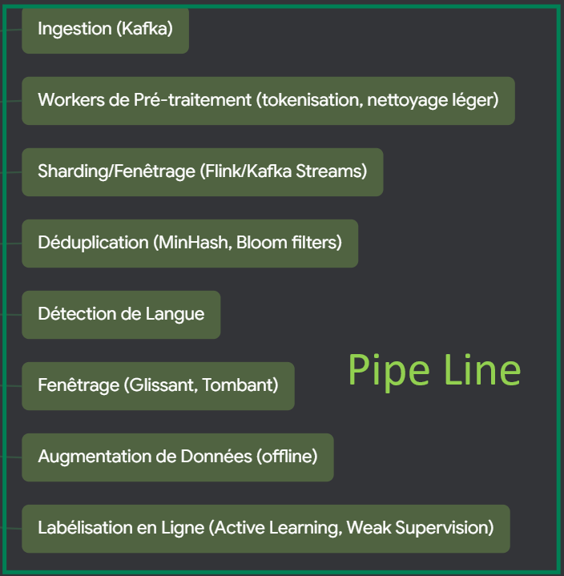

# SENECA-25-26-HACKATHON
THIS reposit is made to showcase the work we've accomplished in 40-hour  ON-SITE hackathon about NLP pipeline organised by SENECA  INSAT TUNIS 
Made by MOHAMED ALI MAATOUG
FEHRI YASSINE
AKREMI YOUSSEF
LAARIF TALEL
TO walk through this reposit we can start by the IDEA:
wW created a service that recommends users posts depending on their interests  and posts in sports field that can handle a big flux in data through our pipeline built on Apache. The model we built ia a powerful recommendation system that loops and feeds itself ensuring the model's continuous improvement and real-time request handling.

THE ABSTRACT ARCHITECTURE IS SHOWN in the graph of the main folder followed by the pipeline architecture, these are theoritical, we plan to fully explore all these components eventually.



The data that we have used for fine-tuning is taken from https://www.kaggle.com/datasets/curiel/rfitness-posts-and-comments, we also did web crawling using Reddit's API, on the r/bodybuilding subreddit.
We used the T5 and GPT2 models for fine-tuning, and also used all-MiniLM-L6-v2.

Link to the demo: https://www.youtube.com/watch?v=8u2Ko07zf-k

# Real-time processing
Our Kafka + Flask API, uses modern solutions (Kafka, FAISS, etc.) to make a low latency NLP pipeline, that is designed for an AI-fueled social media platform.
Our models are light (50 million parameters), and our embeddings are few.

# Accuracy
Our model uses semantic similarity and a user's personal bio, subjects of interests, level of expertise (determined through height and weight), using a weighted formula for each component, to accurately determine what they're most interested in, to give posts ranked by most relevance. This accuracy is noticeable given the posts that appear when refreshing the application after changing the bio (you can see this in the demo).

# Speed
Kafka is especially designed for this. It's designed to coordinate perfectly, to carry a big flux data over many users, receiving updates, and doing gossip updates automatically periodically without compromising latency. We also rely on embedding caching, FAISS, small models, to process data as fast as possible. Our models is so fast that we don't mind adding a web crawler that crawls the r/BodyBuilding subreddit, for continuous ingestion, to further improve the model overtime, by adding more posts to the embedding pool.

# Setup

**Download SENECA-25-26-HACKATHON SOURCE, unpack it, main folders are server and client**


## Server
### Kafka
Download Kafka 2.13, start terminal in Kafka's folder

Start by formatting
```
.\bin\windows\kafka-storage.bat format --standalone -t snPOwrTeRjC9MLXM4V8H4A -c config/server.properties
```

Start the server 
```
.\bin\windows\kafka-server-start.bat config/server.properties
```

Create the two topics
```
bin/kafka-topics.sh --bootstrap-server localhost:9092 --create \   --topic recommender-queries --partitions 1 --replication-factor 1
bin/kafka-topics.sh --bootstrap-server localhost:9092 --create \   --topic recommender-responses --partitions 1 --replication-factor 1
```

Open the `server` folder, we recommend a pyenv of 3.10.11, download dependencies under `server/api`
```
py -m pip install -r requirements.txt
```

Run `recommended.py`, then `app.py``
```
py recommended.py
py app.py
```

# Client
Download latest flutter, go to client folder
```
flutter pub get
flutter run
```
and choose Chrome.


